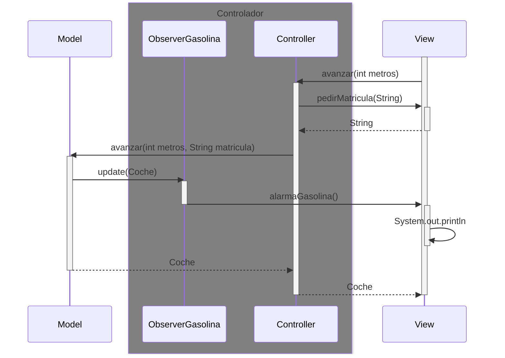
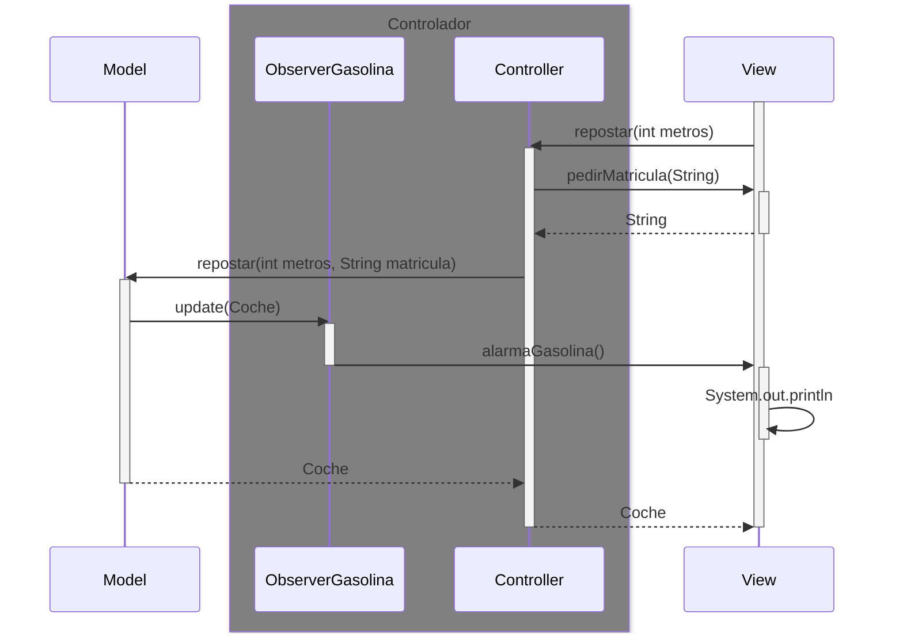
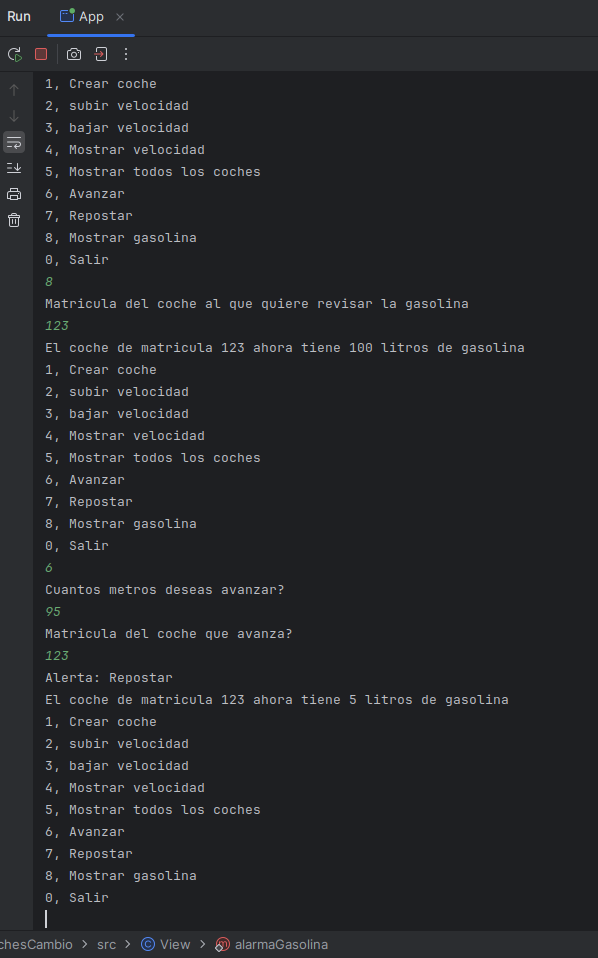
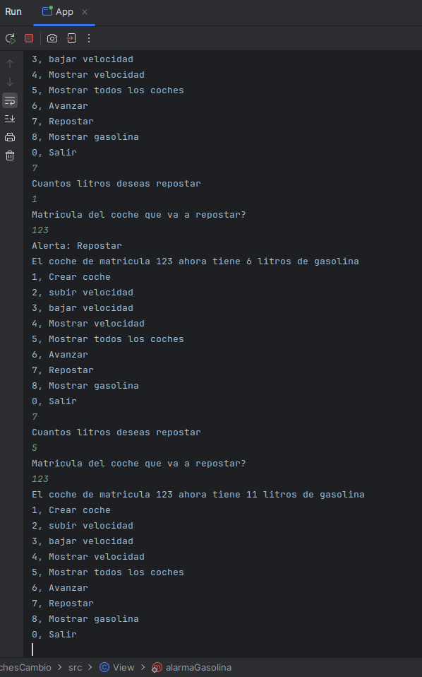
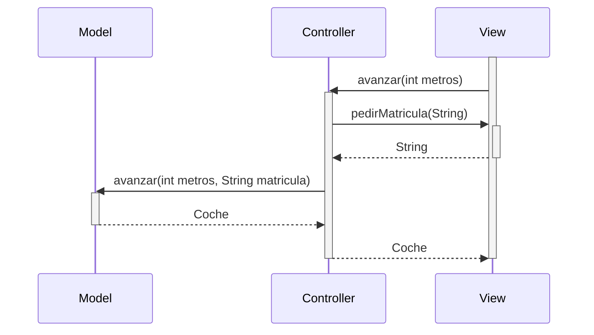
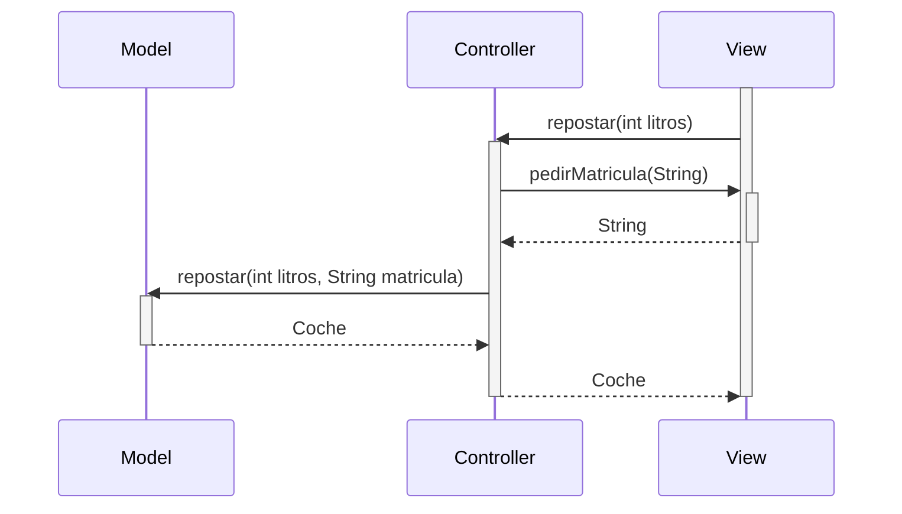
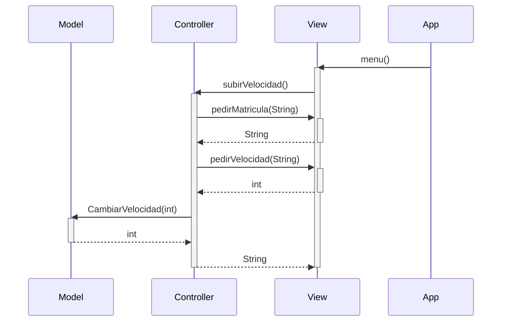
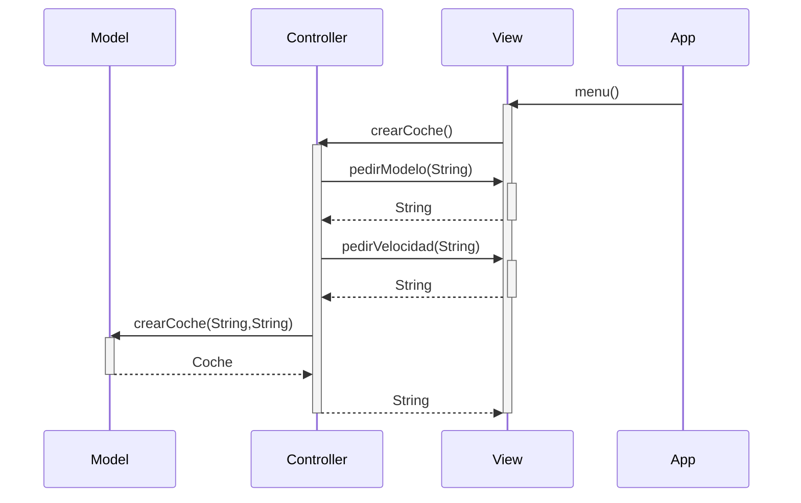

# Examen

### Explicaciones:
* La clase ObserverGasolina es una clase que solo tiene un metodo `update` que recibe un coche
 y compreuba si ese coche tiene una cantidad de gasolina inferior a 10 que es una constante en 
 la clase ObserverGasolina. Si es menor llama a una alarma en la View si no no hace nada
* Tambien solucione un problema en el controller en el que las funciones avanzar y repostar
enviaban el mensaje incorrecto al preguntar por la matricula del coche

### Imagenes del funcionamiento:
  

# Examen-Anterior

## Con respecto del pseudocódigo previsto:  
* Se ha cambiado los parametros de la funcion de la **View** para mostrar la gasolina de un coche de 
solo recibir la gasolina a recibir tambien la matrícula de ese coche para mejorar el mensaje final.
* El cambio anterior supùso que para poder enviar estos 2 datos la **View** debiera recibir el coche entero
para seleccionar estos datos y enviarlo lo que genero en cascada que todas las demas funciones 
cambien el tipo de dato que retornan. 
* El siguiente cambio con respecto al pseudocódigo ocurre en la clase **Model**, en la funcion para avanzar.
Esto ya que al plantearlo en pseudocódigo pense en usar la misma funcion que modifica la gasolina
para avanzar y para repostar pero como avanzar necesita los datos del coche para calcular la gasolina
consumida se volvia mucho más intuitivo y facil cambiar la gasolina directamente desde la misma funcion.
* Cambio en el menu de la clase **View** añadiendo una opcion para mostrar la gasolina de un coche
por separado para facilitar comprobar la gasolina de un coche en cualquier momento 

# Arquitectura MVC

Aplicación que trabaja con objetos coches, modifica la velocidad y la muestra

Crear coche:
